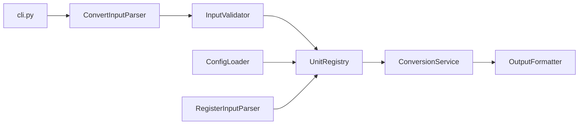

# 01 — UnitConverter_07 Session Transcript

> Source: agent-transcripts/67a3988e-d761-4cfb-89ff-27d9bf38d81e.jsonl
> Exported: 2026-06-05

---

## Turn 1 — user

[external_links omitted]
현재 프로젝트를 아래 깃주소에 연결해줘.
https://github.com/msubkim-ship-it/UnitConverter_07

---

## Turn 2 — assistant

프로젝트의 Git 상태를 확인한 뒤 원격 저장소에 연결하겠습니다.

[Tool: Shell]

[Tool: Glob]

---

## Turn 3 — assistant

[Tool: Shell]

[Tool: Glob]

---

## Turn 4 — assistant

Git 저장소가 없어 초기화하고 원격 저장소를 연결합니다.

[Tool: Read]

[Tool: Shell]

---

## Turn 5 — assistant

[Tool: Shell]

---

## Turn 6 — assistant

[Tool: Shell]

---

## Turn 7 — assistant

[Tool: Shell]

---

## Turn 8 — assistant

로컬 파일이 원격과 동일해 원격 `main` 브랜치를 체크아웃해 연결합니다.

[Tool: Shell]

---

## Turn 9 — assistant

[Tool: Shell]

---

## Turn 10 — assistant

프로젝트를 GitHub 원격 저장소에 연결했습니다.

### 수행한 작업
1. **Git 저장소 초기화** — `c:\DEV\UnitConverter_07`에 `.git` 생성
2. **원격 저장소 등록** — `origin` → https://github.com/msubkim-ship-it/UnitConverter_07.git
3. **`main` 브랜치 연결** — 원격 `origin/main`과 동기화 및 추적 설정

### 현재 상태
| 항목 | 값 |
|------|-----|
| 브랜치 | `main` |
| 추적 | `origin/main` |
| 최신 커밋 | `69a2d78` — add default files |
| 상태 | 원격과 동일 (working tree clean) |

### 이후 사용 방법
```powershell
# 변경사항 커밋 후 푸시
git add .
git commit -m "커밋 메시지"
git push origin main

# 원격 최신 내용 가져오기
git pull origin main
```

작업을 시작하시면 됩니다. 커밋이나 푸시가 필요하면 말씀해 주세요.

---

## Turn 11 — user

git checkout을 연달아하면 계속 하위 레벨의 브랜치가 생성되는거야? 아니면 동일 레벨의 브랜치들이 생성되는거야?

---

## Turn 12 — assistant

`git checkout`을 여러 번 해도 **하위 레벨 브랜치가 계속 생기는 구조는 아닙니다.** Git의 브랜치는 전부 **같은 레벨의 포인터**입니다.

## 핵심

Git에는 “부모 브랜치 / 자식 브랜치” 같은 **계층 구조가 없습니다.**

```text
main ──────●────●────●
              \
feature-a ────●────●
              \
feature-b ──────●
```

- `main`, `feature-a`, `feature-b`는 모두 **동일 레벨**
- 각 브랜치는 특정 커밋을 가리키는 **이름표**일 뿐입니다

## `git checkout`이 하는 일

| 명령 | 동작 |
|------|------|
| `git checkout main` | `main` 브랜치로 **이동** |
| `git checkout -b feature` | **현재 HEAD 기준**으로 `feature`라는 **새 브랜치 생성** 후 이동 |

예:

```bash
git checkout main
git checkout -b feature-a    # main 기준으로 feature-a 생성
git checkout -b feature-b    # feature-a 기준으로 feature-b 생성
```

이렇게 해도 `feature-b`가 `feature-a` **아래에 중첩**되는 게 아니라, 단지 **feature-a가 가리키던 커밋에서 갈라진 또 다른 브랜치**입니다.

## “하위”처럼 보일 수 있는 것

**커밋 히스토리**는 분기/합류가 있어서 트리처럼 보일 수 있습니다.

```text
main:     A ─ B ─ C
               \
feature:        D ─ E
```

- `feature`는 `B`에서 갈라졌지만
- Git 입장에서 `feature`는 `main`의 **하위 브랜치가 아니라**, `B`를 공통 조상으로 하는 **별개 브랜치**입니다

## 정리

- `checkout`을 연달아 해도 → **동일 레벨의 브랜치들**이 생깁니다
- “현재 어떤 브랜치에 있느냐”가 **새 브랜치의 시작점**만 정합니다
- Git 브랜치는 폴더처럼 중첩되지 않고, **모두 repo 안에서 나란히 존재**합니다

원하시면 `main`에서 `feature`를 만들 때와 `feature`에서 또 다른 브랜치를 만들 때의 차이도 예시로 더 풀어드릴게요.

---

## Turn 13 — user

main, staging, spec, red, green, refactoring 으로 이루어지는 브랜치 전략에 대해 설명해주고, spec 단계에서 무엇을 해야할지 알려줘.

---

## Turn 14 — assistant

프로젝트 README를 확인해 브랜치 전략을 프로젝트 맥락에 맞게 설명하겠습니다.

[Tool: Read]

---

## Turn 15 — assistant

이 브랜치 전략은 **Git Flow(배포용 브랜치)**와 **TDD(Red-Green-Refactor)**를 결합한 방식입니다. UnitConverter 실습 맥락에서 설명하겠습니다.

## 전체 브랜치 구조

```text
main          ──●────────●────────●────────  (최종 안정 버전)
                 ↑        ↑
staging       ──●────●────●──────────────  (통합/검증)
                   ↑
refactoring   ──●────●
                   ↑
green         ──●────●
                   ↑
red           ──●────●
                   ↑
spec          ──●────●                      (설계/명세)
```

각 브랜치는 **계층이 아니라 작업 단계**입니다. 한 기능을 만들 때 `spec → red → green → refactoring` 순으로 진행한 뒤, `staging`에서 통합하고, 최종적으로 `main`에 반영합니다.

---

## 브랜치별 역할

| 브랜치 | 역할 | 핵심 질문 |
|--------|------|-----------|
| **spec** | 요구사항 분석, 설계, 인터페이스 정의 | "무엇을, 어떻게 나눠서 만들 것인가?" |
| **red** | **실패하는 테스트** 작성 | "어떤 동작을 검증할 것인가?" |
| **green** | 테스트를 **통과하는 최소 구현** | "테스트를 통과하는 가장 단순한 코드는?" |
| **refactoring** | 구조 개선 (테스트는 계속 통과) | "코드는 깔끔한가?" |
| **staging** | 여러 기능 통합 및 최종 검증 | "전체가 함께 잘 동작하는가?" |
| **main** | 배포 가능한 안정 버전 | "이 상태를 기준으로 삼을 수 있는가?" |

---

## TDD와의 대응 관계

```text
spec        →  설계 단계 (코드 작성 전)
red         →  🔴 Red:   실패하는 테스트
green       →  🟢 Green:  테스트 통과하는 구현
refactoring →  🔵 Refactor: 구조 개선
```

TDD의 Red-Green-Refactor 사이클을 **브랜치로 명시적으로 분리**한 것입니다. 단계가 분리되어 있어 "설계 없이 바로 코딩"하거나 "테스트 없이 리팩토링"하는 실수를 줄일 수 있습니다.

---

## spec 단계에서 해야 할 일

**코드를 최대한 적게, 설계와 명세를 최대한 많이** 하는 단계입니다. 구현은 `green`에서, 테스트는 `red`에서 합니다.

### 1. 요구사항 분석 및 정리

README의 요구사항을 **검증 가능한 항목**으로 쪼갭니다.

```text
[기능]
- meter:2.5 형식 입력 → 다른 모든 단위로 변환 출력
- 지원 단위: meter, feet, yard
- 1 meter = 3.28084 feet, 1 meter = 1.09361 yard

[품질]
- OCP: 새 단위 추가 시 기존 코드 변경 최소화
- SRP: 클래스별 책임 분리
- 입력 검증: 음수, 잘못된 형식, 없는 단위

[추가]
- JSON/YAML 설정 파일에서 비율 로드
- 동적 단위 등록 (1 cubit = 0.4572 meter)
- 출력 포맷: JSON / CSV / 표
```

### 2. 클래스/인터페이스 설계 (OCP + SRP)

구현 전에 **역할 분리**를 문서나 스켈레톤 코드로 정의합니다.

```text
UnitRegistry      → 단위 등록/조회 (OCP: 새 단위 추가 시 여기만 확장)
ConversionService → 변환 계산 로직
InputParser       → "meter:2.5" 파싱 및 검증
OutputFormatter   → JSON/CSV/표 출력 (Strategy 패턴)
ConfigLoader      → 외부 설정 파일 로드
```

각 클래스의 **public 메서드 시그니처**만 정의해 두면 됩니다.

```python
# spec 단계 예시 — 인터페이스/스켈레톤만
class UnitRegistry:
    def register(self, name: str, ratio_to_meter: float) -> None: ...
    def get(self, name: str) -> Unit: ...
    def all_units(self) -> list[str]: ...

class ConversionService:
    def convert(self, value: float, from_unit: str, to_unit: str) -> float: ...
```

### 3. 테스트 시나리오 목록 작성 (아직 코드 X)

`red` 브랜치에서 바로 쓸 **테스트 케이스 목록**을 미리 정리합니다.

```text
[변환 정확성]
- 2.5 meter → 8.2021 feet (소수점 반올림 확인)
- 2.5 meter → 2.7340 yard
- feet ↔ yard 간 변환 (meter 기준)

[입력 검증]
- 음수 입력 → 에러
- "abc:2.5" → 없는 단위 에러
- "meter" (값 없음) → 형식 에러
- "meter:-1" → 음수 에러

[동적 등록]
- cubit 등록 후 변환 가능

[출력 포맷]
- JSON/CSV/표 각각 올바른 형식
```

### 4. 설정 파일 구조 정의

```json
{
  "base_unit": "meter",
  "units": {
    "meter": 1.0,
    "feet": 3.28084,
    "yard": 1.09361
  }
}
```

### 5. spec 단계 산출물 체크리스트

| 산출물 | 완료 기준 |
|--------|-----------|
| 요구사항 목록 | 기능/품질/추가 요구사항이 항목별로 정리됨 |
| 클래스 다이어그램 또는 역할表 | SRP/OCP를 만족하는 구조 |
| public API 시그니처 | 메서드 이름, 파라미터, 반환값 정의 |
| 테스트 시나리오 목록 | red 단계에서 바로 TC 작성 가능 |
| 설정 파일 스키마 | JSON/YAML 구조 확정 |
| 예외/에러 정책 | 어떤 입력에 어떤 에러를 낼지 정의 |

---

## spec → red로 넘어갈 때

spec이 충분히 되었는지 아래를 확인합니다.

- "이 클래스가 뭘 하는지" 한 문장으로 설명 가능한가?
- red에서 테스트를 쓸 때 **설계를 다시 바꿀 필요가 없는가?**
- 새 단위 추가 시 **어느 클래스만 수정하면 되는지** 명확한가?

---

## UnitConverter 실습 흐름 예시

```text
spec 브랜치
  └─ UnitRegistry, ConversionService 등 설계 문서 + 스켈레ton

red 브랜치 (spec에서 분기)
  └─ test_conversion.py 작성 → 전부 FAIL

green 브랜치 (red에서 분기)
  └─ 최소 구현 → 전부 PASS

refactoring 브랜치 (green에서 분기)
  └─ OCP/SRP 정리, 중복 제거 → 여전히 PASS

staging ← merging
  └─ 통합 테스트

main ← merging
  └─ 최종 안정 버전
```

---

**한 줄 요약:** `spec`은 **"무엇을, 어떤 구조로 만들지"** 정하는 단계이고, 실제 테스트는 `red`, 구현은 `green`, 구조 개선은 `refactoring`에서 합니다. spec에서 설계를 충분히 해두면 이후 단계에서 방향을 바꾸는 일이 크게 줄어듭니다.

spec 브랜치용 설계 문서나 클래스 스켈레톤을 같이 작성해 드릴까요?

---

## Turn 16 — user

@README.md  @UnitConverter.py  레거시 코드 스멜과 PRD 갭을 목록으로 정리해줘.

---

## Turn 17 — assistant

README와 현재 코드를 읽고 레거시 스멜과 PRD 갭을 정리합니다.

[Tool: Read]

[Tool: Read]

---

## Turn 18 — assistant

## 레거시 코드 스멜

`UnitConverter.py`는 36줄짜리 단일 스크립트로, 아래 스멜이 있습니다.

### 구조 / 설계

| # | 스멜 | 위치 | 설명 |
|---|------|------|------|
| 1 | **God Function** | `main()` 전체 | 입력·파싱·검증·변환·출력이 한 함수에 몰려 있음 |
| 2 | **SRP 위반** | 파일 전체 | 클래스/모듈 분리 없음 — README의 SRP 요구와 불일치 |
| 3 | **OCP 위반** | L16–24 | `if-elif`로 단위 분기 — 단위 추가 시 `main()` 수정 필요 |
| 4 | **Switch 문 남용** | L16–24 | 단위별 분기가 하드코딩되어 확장 불가 |
| 5 | **관심사 혼재** | `main()` | CLI(I/O), 파싱, 도메인 로직, 포맷팅이 한곳에 섞임 |

### 데이터 / 로직

| # | 스멜 | 위치 | 설명 |
|---|------|------|------|
| 6 | **Magic Number** | L19–21, L27–28 | `3.28084`, `1.09361`이 여러 곳에 반복 |
| 7 | **중복 로직** | L16–24 vs L26–28 | meter 변환(in) / 다른 단위 변환(out)이 별도 경로 |
| 8 | **하드코딩된 단위 목록** | L16–32 | meter/feet/yard가 3곳 이상에 고정 |
| 9 | **불필요한 변수** | L26 | `in_meters = meter_value` — 동일 값의 중복 표현 |
| 10 | **자기 자신 변환 출력** | L30 | `2.5 meter = 2.5 meter` — 의미 없는 결과 포함 |

### 입력 / 출력

| # | 스멜 | 위치 | 설명 |
|---|------|------|------|
| 11 | **불완전한 입력 검증** | L4–14 | `:` 없음·숫자 오류만 처리, 음수·공백·빈 단위 미처리 |
| 12 | **에러 처리 방식** | L5–6, L13–14 | `print` + `return` — 예외/에러 타입 없음, 테스트·재사용 어려움 |
| 13 | **출력 포맷 미정의** | L30–32 | raw float 출력 — PRD 예시(`8.2`, `2.7`)와 형식 불일치 |
| 14 | **반올림/정밀도 미처리** | L30–32 | `8.2021...` 등 긴 소수 출력 가능 |

### 품질 / 유지보수

| # | 스멜 | 위치 | 설명 |
|---|------|------|------|
| 15 | **테스트 부재** | 프로젝트 전체 | 테스트 파일·프레임워크 없음 |
| 16 | **설정 하드코딩** | L19–28 | 변환 비율이 코드에 박혀 있음 — 외부 설정 불가 |
| 17 | **확장 포인트 없음** | 파일 전체 | 인터페이스·Strategy·Registry 등 확장 구조 없음 |
| 18 | **단일 진입점 의존** | L35–36 | `main()` CLI에만 묶여 있어 API/테스트 재사용 불가 |

---

## PRD 갭 (README 요구사항 vs 현재 구현)

### 기본 요구사항 갭

| # | PRD 요구사항 | 현재 상태 | 갭 |
|---|-------------|----------|-----|
| 1 | `meter:2.5` 입력 → **다른 모든 단위**로 변환 출력 | 3개 단위 전부 출력 (입력 단위 포함) | 입력 단위 제외 출력 여부 미정의 |
| 2 | 출력 예: `2.5 meter = 8.2 feet` (소수 1자리) | raw float 출력 | **반올림/포맷 규칙 미구현** |
| 3 | meter, feet, yard 지원 | 3단위 하드코딩으로 동작 | 기능은 있으나 **확장 불가 구조** |
| 4 | 새 단위 추가 시 기존 코드 변경 최소화 (OCP) | `elif` 분기 추가 필요 | **OCP 미충족** |
| 5 | 단위 간 변환 정확도 + **테스트 코드** | 테스트 없음 | **TC 전면 부재** |
| 6 | `1m = 3.28084ft`, `1m = 1.09361yd` | 상수값은 일치 | 비율 자체는 맞음 |
| 7 | feet/yard 비율은 meter 기반 계산 | 각각 독립 상수로 hardcode | meter 기준 **단일 소스** 아님 |

### 품질 요구사항 갭

| # | PRD 요구사항 | 현재 상태 | 갭 |
|---|-------------|----------|-----|
| 8 | OCP 설계 | if-elif 체인 | 인터페이스/Registry 등 **설계 없음** |
| 9 | SRP 클래스 구성 | 단일 `main()` 함수 | **클래스 분리 없음** |
| 10 | 음수 입력 검증 | 미구현 | **음수 허용** |
| 11 | 잘못된 형식 검증 | `:` 없음, 숫자 오류만 | `meter:`, ` meter:2.5`, 빈 입력 등 **미완** |
| 12 | 없는 단위 검증 | `Unknown unit` 출력 | 기본 동작만 있음 |

### 추가 요구사항 갭

| # | PRD 요구사항 | 현재 상태 | 갭 |
|---|-------------|----------|-----|
| 13 | 변환 비율 **JSON/YAML 외부 설정** | 코드 내 상수 | **설정 외부화 0%** |
| 14 | 동적 단위 등록 (`1 cubit = 0.4572 meter`) | 미구현 | **런타임 등록 불가** |
| 15 | 출력 포맷: JSON / CSV / 표 | `print` 고정 | **포맷 선택 0%** |

### Activities / 산출물 갭

| # | PRD (Activities) | 현재 상태 | 갭 |
|---|-----------------|----------|-----|
| 16 | TC: 단위변환 + 입력 검증 | 테스트 없음 | **red 단계 TC 없음** |
| 17 | 추가 요구 3건 + TC | 전부 미구현 | **추가 요구 0/3** |
| 18 | 가상환경/실행 가이드 | README만 존재 | `venv`, `requirements.txt` 등 **프로젝트 설정 없음** |

---

## 요약 매트릭스

```text
영역              PRD 충족도    핵심 갭
─────────────────────────────────────────────
기본 변환 기능      △ (60%)     포맷·OCP·테스트
품질 (OCP/SRP)      ✗ (10%)     설계·검증 전면
추가 요구사항       ✗ (0%)      설정·동적등록·출력포맷
테스트              ✗ (0%)      TC 없음
```

**우선순위 제안 (spec → red 순):**
1. 클래스 분리 + UnitRegistry (OCP/SRP)
2. 입력 검증 완성 (음수, 형식, 공백)
3. 변환 TC 작성 (red)
4. 설정 외부화 → 동적 등록 → 출력 포맷 (추가 요구)

spec 브랜치용 클래스 설계안이나 red 단계 테스트 시나리오 목록도 정리해 드릴 수 있습니다.

---

## Turn 19 — user

OCP/SRP를 만족하는 Python 패키지 구조를 제안하고, PRD의 FR/NFR을 매핑해줘.

---

## Turn 20 — assistant

## 제안 패키지 구조

OCP는 **확장 포인트(Registry, Strategy, Loader)**로, SRP는 **모듈·클래스 단위 책임 분리**로 만족하는 구조입니다.

```text
UnitConverter_07/
├── config/
│   └── units.json                 # 기본 변환 비율 (외부 설정)
├── unit_converter/                # 애플리케이션 패키지
│   ├── __init__.py
│   ├── __main__.py                # python -m unit_converter
│   ├── cli.py                     # CLI 오케스트레이션만
│   ├── exceptions.py              # 도메인/입력 예외
│   │
│   ├── domain/                    # 핵심 도메인 (변환 규칙)
│   │   ├── __init__.py
│   │   ├── models.py              # Unit, ConversionRequest, ConversionResult
│   │   └── conversion_service.py  # meter 기준 변환 계산
│   │
│   ├── registry/                  # OCP: 단위 확장 지점
│   │   ├── __init__.py
│   │   └── unit_registry.py       # 등록/조회, 동적 단위 추가
│   │
│   ├── parsing/                   # SRP: 입력 파싱만
│   │   ├── __init__.py
│   │   ├── convert_input_parser.py    # "meter:2.5"
│   │   └── register_input_parser.py   # "1 cubit = 0.4572 meter"
│   │
│   ├── validation/                # SRP: 검증만
│   │   ├── __init__.py
│   │   └── input_validator.py
│   │
│   ├── config/                    # OCP: 설정 소스 확장
│   │   ├── __init__.py
│   │   ├── loader.py              # ConfigLoader Protocol/ABC
│   │   ├── json_loader.py
│   │   └── yaml_loader.py
│   │
│   └── output/                    # OCP: 출력 포맷 Strategy
│       ├── __init__.py
│       ├── formatter.py           # OutputFormatter ABC
│       ├── table_formatter.py
│       ├── json_formatter.py
│       └── csv_formatter.py
│
├── tests/
│   ├── unit/
│   │   ├── test_conversion_service.py
│   │   ├── test_unit_registry.py
│   │   ├── test_input_validator.py
│   │   ├── test_parsers.py
│   │   └── test_formatters.py
│   └── integration/
│       └── test_cli_flow.py
│
├── UnitConverter.py               # (선택) 하위 호환 thin wrapper
├── requirements.txt
└── README.md
```

---

## 클래스 책임 (SRP)

| 클래스/모듈 | 단일 책임 | SRP 근거 |
|-------------|-----------|----------|
| `ConvertInputParser` | `unit:value` 문자열 → 구조화 데이터 | 파싱만, 검증·변환 없음 |
| `RegisterInputParser` | `1 cubit = 0.4572 meter` 파싱 | 등록 문법만 담당 |
| `InputValidator` | 음수·형식·미등록 단위 검증 | 검증 규칙만 |
| `UnitRegistry` | 단위 저장·조회·동적 등록 | 변환 계산 없음 |
| `ConversionService` | meter 기준 변환 수학 | I/O·포맷·파싱 없음 |
| `ConfigLoader` (+ JSON/YAML) | 외부 파일 → Registry 초기화 | 파일 읽기만 |
| `OutputFormatter` (+ 구현체) | 결과 → 문자열/JSON/CSV | 변환 로직 없음 |
| `cli.py` | 사용자 흐름 조립 | 도메인 규칙 직접 구현 없음 |

---

## OCP 확장 포인트

```text
[새 단위 추가]
  config/units.json 수정  또는  RegisterInputParser → UnitRegistry.register()
  → ConversionService, Formatter, Validator 수정 불필요

[새 출력 포맷 추가]
  output/xml_formatter.py 구현 → OutputFormatter 상속
  → cli에서 formatter 선택만 추가

[새 설정 포맷 추가]
  config/toml_loader.py 구현 → ConfigLoader Protocol 준수
  → Registry/Service 수정 불필요
```

---

## FR 매핑 (기능 요구사항)

| ID | PRD 요구사항 | 담당 모듈/클래스 | 구현 포인트 |
|----|-------------|------------------|-------------|
| **FR-01** | `meter:2.5` 형식 입력 수신 | `cli.py`, `ConvertInputParser` | CLI에서 입력 → `(unit, value)` 파싱 |
| **FR-02** | 입력값을 **다른 모든 단위**로 변환 출력 | `ConversionService`, `UnitRegistry`, `output/*` | 입력 단위 제외 loop 변환 |
| **FR-03** | meter, feet, yard 기본 지원 | `config/units.json`, `UnitRegistry` | 앱 시작 시 ConfigLoader로 seed |
| **FR-04** | `1m=3.28084ft`, `1m=1.09361yd` 정확 변환 | `ConversionService` | meter 기준 단일 공식 |
| **FR-05** | feet↔yard는 meter 기반 간접 계산 | `ConversionService` | `value_in_m / ratio_to_m` 통일 |
| **FR-06** | 변환 비율 외부 설정(JSON/YAML) | `config/loader.py`, `json_loader.py`, `yaml_loader.py` | `base_unit` + `units` 스키마 |
| **FR-07** | 동적 단위 등록 (`1 cubit = 0.4572 meter`) | `RegisterInputParser`, `UnitRegistry.register()` | 런타임 Registry 확장 |
| **FR-08** | 출력 포맷 선택 (JSON/CSV/표) | `output/formatter.py` + 구현체 3종 | Strategy 패턴, CLI 옵션 |
| **FR-09** | 변환 결과 표시 (`2.5 meter = 8.2 feet`) | `TableFormatter` (+ 공통 `format_value()`) | 소수 자릿수·반올림 규칙 |

---

## FR 매핑 (입력 검증 — PRD 품질 요구)

| ID | PRD 요구사항 | 담당 모듈/클래스 | 검증 케이스 |
|----|-------------|------------------|-------------|
| **FR-10** | 음수 입력 거부 | `InputValidator` | `meter:-1` → `NegativeValueError` |
| **FR-11** | 잘못된 형식 거부 | `ConvertInputParser`, `InputValidator` | `meter`, `abc`, `meter:abc`, `:` 없음 |
| **FR-12** | 없는 단위 거부 | `InputValidator` + `UnitRegistry` | `inch:2.5` → `UnknownUnitError` |

---

## NFR 매핑 (비기능 요구사항)

| ID | PRD 요구사항 | 담당 설계 | 충족 방식 |
|----|-------------|-----------|-----------|
| **NFR-01** | OCP | `UnitRegistry`, `OutputFormatter`, `ConfigLoader` | 새 단위/포맷/설정은 **추가(extend)**만, 기존 Service 수정 금지 |
| **NFR-02** | SRP | 모듈 6개 + 클래스 1책임 1클래스 | 파싱·검증·변환·출력·설정·CLI 분리 |
| **NFR-03** | 테스트 가능 | `domain/`, `registry/`, `validation/` | CLI 없이 Service/Registry 단위 테스트 |
| **NFR-04** | 변환 정확도 검증 TC | `tests/unit/test_conversion_service.py` | 비율·반올림·feet↔yard TC |
| **NFR-05** | 입력 검증 TC | `tests/unit/test_input_validator.py` | FR-10~12 케이스 |
| **NFR-06** | 추가 요구 TC | `tests/unit/test_formatters.py`, `test_unit_registry.py` | 동적 등록·JSON/CSV/표 출력 |
| **NFR-07** | 유지보수성 | 패키지 경계 + `exceptions.py` | 에러 타입 명확, main() God Function 제거 |
| **NFR-08** | 설정 외부화 | `config/units.json` | Magic Number 코드 제거 |

---

## 데이터 흐름



```text
1. ConfigLoader → UnitRegistry 초기화 (meter/feet/yard)
2. (선택) RegisterInputParser → UnitRegistry.register(cubit)
3. ConvertInputParser → InputValidator → ConversionService.convert_all()
4. OutputFormatter.format(results) → stdout
```

---

## 핵심 인터페이스 스케치

```python
# registry/unit_registry.py  — OCP 확장 지점
class UnitRegistry:
    def register(self, name: str, ratio_to_base: float) -> None: ...
    def get(self, name: str) -> Unit: ...
    def all_except(self, name: str) -> list[Unit]: ...

# domain/conversion_service.py  — 변환만
class ConversionService:
    def convert(self, value: float, from_unit: str, to_unit: str) -> float: ...
    def convert_to_all(self, value: float, from_unit: str) -> list[ConversionResult]: ...

# output/formatter.py  — OCP Strategy
class OutputFormatter(ABC):
    @abstractmethod
    def format(self, results: list[ConversionResult]) -> str: ...
```

---

## 레거시 → 신규 매핑

| 현재 `UnitConverter.py` | 이동 대상 |
|-------------------------|-----------|
| L2 `input()` | `cli.py` |
| L4–14 파싱/형식 검증 | `ConvertInputParser` + `InputValidator` |
| L16–24 단위 분기 | `UnitRegistry` + `ConversionService` |
| L19–28 Magic Number | `config/units.json` + `ConfigLoader` |
| L30–32 `print` | `TableFormatter` (기본) |
| (없음) | `RegisterInputParser`, `JsonFormatter`, `CsvFormatter` |

---

## spec 브랜치 산출물 체크리스트

spec 단계에서 아래만 확정하면 red로 넘어갈 수 있습니다.

- [ ] `config/units.json` 스키마 (`base_unit`, `units`, `precision`)
- [ ] `exceptions.py` 에러 타입 목록 (FR-10~12)
- [ ] `ConversionResult` 데이터 클래스 필드
- [ ] `OutputFormatter` 3종 출력 샘플 (JSON/CSV/표)
- [ ] TC 목록: `tests/unit/` 파일별 케이스 15~20개

원하시면 이 구조로 **spec 브랜치용 스켈레톤 파일**을 바로 생성해 드릴 수 있습니다.

---

## Turn 21 — user

UnitConverter_07 프로젝트를 Dual-Track TDD, ECB 기반으로 진행할거야. 아래 8계층과 Hook에 대한 역할을 한줄씩 설명해줘.
- Model, Agent, Harness
- Rule, Skill, Command
- Tool/MCP, Test/Review Loop
- Hook
아직 .cursorrules, Skill, Command, hooks.json 은 없다고 가정.

---

## Turn 22 — assistant

Dual-Track TDD·ECB 맥락에 맞추기 위해 Cursor의 Rule, Skill, Command, Hook 관련 스킬 정의를 확인합니다.

[Tool: Read]

[Tool: Read]

[Tool: Read]

[Tool: Grep]

---

## Turn 23 — assistant

UnitConverter_07를 **Dual-Track TDD + ECB**로 진행할 때, 8계층과 Hook의 역할을 한 줄씩 정리했습니다. (아직 `.cursorrules`, Skill, Command, `hooks.json`이 없다는 전제)

---

## 전제: Dual-Track TDD · ECB

| 용어 | 의미 (이 프로젝트 기준) |
|------|-------------------------|
| **Dual-Track TDD** | **Track A (Spec)**: PRD·설계·인터페이스 확정 / **Track B (TDD)**: red → green → refactoring 브랜치 사이클 |
| **ECB** | **E**xecute(실행) · **C**ontrol(통제) · **B**ind(연결) — Model→Agent→Harness가 실행하고, Rule/Skill/Command가 통제하며, Tool·Loop·Hook이 단계를 묶는 3층 구조 |

---

## 1층 — Model · Agent · Harness (실행 주체)

| 계층 | 한 줄 설명 |
|------|-----------|
| **Model** | spec/red/green/refactoring 단계별로 **코드·테스트·설계 문서를 추론·생성**하는 LLM 두뇌 |
| **Agent** | Model 출력을 받아 **브랜치·파일·pytest·git을 실제로 조작**하며 Dual-Track 작업을 진행하는 Cursor 자율 실행체 |
| **Harness** | Agent·Model 판단과 무관하게 **pytest/커버리지/브랜치 가드를 기계적으로 실행**하는 테스트·CI 골격 (Dual-Track Track B의 객관적 판정기) |

---

## 2층 — Rule · Skill · Command (통제·가이드)

| 계층 | 한 줄 설명 |
|------|-----------|
| **Rule** | `.cursor/rules/` 또는 `.cursorrules`에 **항상/조건부로 적용되는 프로젝트 헌법** (OCP/SRP, spec 브랜치에서 구현 금지, magic number 금지 등) |
| **Skill** | `.cursor/skills/`의 **재사용 워크플로우 매뉴얼** (예: PRD 갭 분석, red TC 작성, Formatter Strategy 추가) — Agent가 특정 상황에서 읽고 따름 |
| **Command** | `/spec-start`, `/red-next` 같은 **사용자가 명시적으로 호출하는 단계 진입 트리거** — “지금 spec인지 red인지”를 Agent에 선언적으로 알려줌 |

---

## 3층 — Tool/MCP · Test/Review Loop (행동·품질 피드백)

| 계층 | 한 줄 설명 |
|------|-----------|
| **Tool/MCP** | Shell·파일편집·GitHub MCP 등 **Agent의 손** — `git checkout`, `pytest`, 설정 JSON 로드, PR 생성 같은 외부 작업 수행 |
| **Test/Review Loop** | Dual-Track TDD의 **핵심 순환**: red(실패) → green(통과) → refactoring(통과 유지) → PRD/코드 리뷰 → staging 통합을 반복하는 피드백 고리 |

---

## 4층 — Hook (이벤트 자동화)

| 계층 | 한 줄 설명 |
|------|-----------|
| **Hook** | `.cursor/hooks.json` + 스크립트로 **Agent 이벤트 전후에 자동 개입** (예: red 브랜치에서 테스트 통과 시 경고, `UnitConverter.py` 편집 후 pytest 자동 실행, spec 브랜치에서 impl 파일 수정 차단) |

---

## 8계층 + Hook 관계 (한눈에)

```text
[Control]  Rule ─ Skill ─ Command
                ↓
[Execute]  Model → Agent ← Harness
                ↓
[Bind]     Tool/MCP ↔ Test/Review Loop
                ↓
[Automate] Hook (이벤트 훅)
```

---

## UnitConverter_07 브랜치별 “누가 주도하는가”

| 브랜치 | 주도 계층 | Hook/Loop 역할 |
|--------|-----------|----------------|
| **spec** | Rule + Skill + Command | Hook: impl/test 파일 편집 경고 |
| **red** | Agent + Harness | Loop: **반드시 FAIL** 확인 |
| **green** | Agent + Tool | Loop: **PASS**까지 구현 |
| **refactoring** | Rule + Loop | Loop: PASS 유지하며 구조 개선 |
| **staging → main** | Harness + Review Loop | Hook: merge 전 전체 pytest |

---

## 아직 없을 때 각 계층의 “첫 역할”

| 없는 것 | Dual-Track TDD에서 맡을 첫 역할 |
|---------|----------------------------------|
| `.cursorrules` / Rule | “spec=설계만, red=테스트만, green=최소 구현” 브랜치 규율 |
| Skill | `dual-track-red.md` — ConversionService 실패 TC 작성 절차 |
| Command | `/tdd-red`, `/tdd-green` — 현재 트랙·브랜치 선언 |
| `hooks.json` | `afterFileEdit` → `tests/` 변경 시 pytest 자동 실행 |

원하시면 다음 단계로 **UnitConverter_07용 Rule·Skill·Command·hooks.json 초안**을 Dual-Track 브랜치 전략에 맞춰 작성해 드리겠습니다.

---

## Turn 24 — user

UnitConverter_07 ECB + Dual-Track TDD용 최소 Harness를 만들어줘.
- pyproject.toml (pytest만)
- src/boundary, src/control, src/entity (빈 __init__.py)
- tests/entity, tests/control, tests/boundary (빈 __init__.py)
코드·테스트 본문은 아직 작성하지 마. Harness 골격만.

---

## Turn 25 — assistant

프로젝트 상태를 확인한 뒤 Harness 골격만 생성합니다.

[Tool: Glob]

[Tool: Read]

---

## Turn 26 — assistant

요청한 Harness 골격 파일을 생성합니다.

[Tool: Write]

[Tool: Write]

[Tool: Write]

[Tool: Write]

[Tool: Write]

[Tool: Write]

[Tool: Write]

---

## Turn 27 — assistant

[Tool: Shell]

---

## Turn 28 — assistant

Harness 골격만 생성했습니다.

## 생성된 구조

```text
UnitConverter_07/
├── pyproject.toml
├── src/
│   ├── boundary/__init__.py
│   ├── control/__init__.py
│   └── entity/__init__.py
└── tests/
    ├── boundary/__init__.py
    ├── control/__init__.py
    └── entity/__init__.py
```

## `pyproject.toml` 요약

- `pytest>=8.0` — `[project.optional-dependencies].dev`에만 정의
- `testpaths = ["tests"]`
- `pythonpath = ["src"]` — ECB 레이어(`entity`, `control`, `boundary`) import 경로

## ECB ↔ Dual-Track 매핑 (Harness 관점)

| 경로 | Harness 역할 |
|------|----------------|
| `src/entity` | 도메인 모델·변환 규칙 (Track B green 대상) |
| `src/control` | 유스케이스·오케스트레이션 |
| `src/boundary` | CLI·파서·포맷터 등 I/O 경계 |
| `tests/entity` | entity 레이어 red TC |
| `tests/control` | control 레이어 red TC |
| `tests/boundary` | boundary 레이어 red TC |

## 실행 (로컬)

```powershell
pip install -e ".[dev]"
pytest --collect-only   # 현재: tests collected: 0
```

코드·테스트 본문은 넣지 않았습니다. red 브랜치에서 `tests/entity/` 등에 TC부터 추가하면 됩니다.

---

## Turn 29 — user

UnitConverter_07 루트에 .cursorrules 초안을 새로 만들어줘. (현재 없음)
도메인은 직접 제안해줘.
아키텍처:
- ECB: boundary→control→entity, entity→* import 금지
- Dual-Track: Logic(entity/control) Domain Mock 금지 / UI(boundary) Mock 허용
- 테스트 ID: D-* (Logic), U-* (UI), 파일명 test_d_* / test_u_*
TDD:
- RED→GREEN→REFACTOR, assert 완화·skip·xfail 금지
- MagicConstant SSOT (34/16 리터럴 산재 금지)
AI 행동:
- 한국어, TDD 시 Phase/Layer/Track 선언
- git commit은 사용자 요청 시만
40~80줄 초안. 다른 파일은 만들지 마.

---

## Turn 30 — assistant

UnitConverter 도메인과 ECB·Dual-Track 규칙을 반영한 `.cursorrules` 초안을 작성합니다.

[Tool: Glob]

[Tool: Read]

---

## Turn 31 — assistant

[Tool: Write]

---

## Turn 32 — assistant

`.cursorrules` 초안을 루트에 생성했습니다. (약 55줄)

## 포함 내용 요약

**도메인 (직접 제안)**
- 길이 단위 변환 — `단위:값` 입력 → 등록 단위 전체 변환
- meter 기준, feet/yard 기본, 동적 등록·외부 설정 지원

**아키텍처**
- ECB 단방향: `boundary → control → entity`, entity의 상위 import 금지
- Dual-Track: Logic(entity/control) Mock 금지 / UI(boundary) Mock 허용
- TC ID: `D-*` / `U-*`, 파일명 `test_d_*` / `test_u_*`

**TDD**
- RED→GREEN→REFACTOR, assert 완화·skip·xfail 금지
- MagicConstant SSOT (`entity/constants.py` 또는 `config/units.json`)

**AI 행동**
- 한국어, `[Phase | Layer | Track]` 선언
- 브랜치별 수정 범위 제한
- commit은 사용자 요청 시만

수정이 필요하면 알려주세요. (예: 도메인 용어 통일, 브랜치 규칙 강화, TC ID 형식 세분화)

---

## Turn 33 — user

@.cursorrules 초안을 리뷰만 해. 파일 수정하지 마.

Rule(헌법) 관점 체크:
- ECB import 방향
- Logic vs UI Track Mock
- 입출력·E001~E007
- TDD 게이트·금지 사항
- Test/Review Loop와 연결될 pytest 규칙
- Hook과 겹칠 규칙 (예: Golden Master 재생성 승인)
| 우선순위 | 추가/수정 문장 | 이유 |

---

## Turn 34 — assistant

[Tool: Read]

[Tool: Grep]

---

## Turn 35 — assistant

`.cursorrules` 초안(55줄)을 **Rule(헌법)** 관점에서만 리뷰합니다. 파일은 수정하지 않았습니다.

---

## 종합 판정

| 영역 | 현재 상태 | 헌법 완성도 |
|------|-----------|-------------|
| ECB import 방향 | 골격 있음 | △ — tests·config SSOT 모호 |
| Logic/UI Mock | 원칙 1줄 | △ — 허용·금지 경계 미정의 |
| 입출력·E001~E007 | **없음** | ✗ — 에러 계약 공백 |
| TDD 게이트·금지 | 핵심 있음 | △ — Phase별 pytest 게이트 없음 |
| Test/Review Loop | ID·파일명만 | △ — Loop 절차·pytest 연결 없음 |
| Hook 분리 | **없음** | ✗ — 정책/집행 경계 미명시 |

**강점:** ECB 3계층·Dual-Track·TDD 금지 4종·브랜치별 수정 범위·SSOT·AI Phase 선언이 한 파일에 압축되어 있음.  
**약점:** 헌법으로서 **계약(에러·I/O)·집행 경계(Hook)·pytest 게이트**가 빠져 Test/Review Loop와 연결 시 해석 분쟁이 날 여지가 큼.

---

## 영역별 코멘트

### 1. ECB import 방향
- L9–18: `boundary → control → entity`, entity/control 역방향 금지 — **명확**
- L19: SSOT가 `entity/constants.py` **또는** `config/units.json` — **이중 SSOT**로 MagicConstant 금지(L40)와 충돌 가능
- **누락:** `tests/{entity,control,boundary}` → `src/` import 허용 범위, `entity` 간 역방향, `UnitConverter.py`(레거시) import 금지

### 2. Logic vs UI Track Mock
- L24–25: 원칙은 맞으나 **“도메인 Mock” 정의 없음**
- boundary Mock 허용은 있으나, control 테스트에서 `UnitRegistry`/`ConversionService`를 `Mock`/`patch`하는지 여부 불명
- Logic Track에서 **InMemory Registry·Fake Formatter 금지 여부** 미기재

### 3. 입출력·E001~E007
- L55: “음수·형식·미등록”만 언급, **코드·메시지·레이어 책임 없음**
- E001~E007 정의·매핑·출력 형식 전무 → spec/red에서 TC·구현 기준 불가

### 4. TDD 게이트·금지 사항
- L34–40: RED/GREEN/REFACTOR + skip/xfail/assert 완화 금지 — **양호**
- **누락:** RED=`pytest` exit 1 필수, GREEN/REFACTOR=exit 0, red에서 `src/` 편집 금지(L47)의 **검증 방법**, refactoring에서 TC 추가/삭제 금지 여부

### 5. Test/Review Loop ↔ pytest
- L29–32: ID·파일명 규칙만 있음
- **누락:** Phase별 실행 범위(`tests/entity/` vs 전체), Review Loop(RED FAIL 확인 → GREEN PASS → PRD 대조) 절차, `pyproject.toml` `testpaths`/`pythonpath`와의 정합

### 6. Hook과 겹칠 규칙
- `.cursorrules` = **정책 선언**, Hook = **기계적 집행** 분리 문장 없음
- Golden Master, red/green 게이트, commit 금지(L49) 등은 Hook 후보인데 Rule에 “Hook이 집행한다”고 안 적혀 **이중·삼중 규칙** 위험

---

## 추가/수정 제안 (우선순위표)

| 우선순위 | 추가/수정 문장 | 이유 |
|:--:|---|---|
| **P0** | `에러 코드 E001~E007은 entity/exceptions.py에 SSOT로 정의한다. boundary는 코드를 사용자 메시지로 변환만 하며, control/entity는 코드만 raise한다.` | 입출력·에러 계약이 헌법에 없어 Logic/UI TC·Formatter 출력 기준 불가 |
| **P0** | `\| E001 \| 형식 오류 (콜론 없음, 빈 입력) \| E002 \| 숫자 변환 실패 \| E003 \| 음수 \| E004 \| 미등록 단위 \| E005 \| 빈 단위명 \| E006 \| 등록 문법 오류 \| E007 \| 중복 단위/설정 충돌 \|` | E001~E007 매핑 없이 “입력 검증”(L55)만으로는 D-/U- TC ID와 1:1 연결 불가 |
| **P0** | `MagicConstant SSOT는 entity/constants.py 단일이다. config/units.json은 boundary가 로드하여 control.register()로 주입하며, JSON 수치를 테스트/코드에 리터럴로 복사하지 않는다.` | L19 “또는”이 SSOT 원칙(L40)과 충돌 — 34/16식 산재 재발 |
| **P1** | `Logic Track(entity/control)에서는 domain 객체·변환 로직에 unittest.mock/MagicMock/pytest-mock patch를 사용하지 않는다. InMemory Registry·실제 ConversionService로 검증한다.` | “도메인 Mock 금지”(L24)만으로 patch 허용 오해 가능 |
| **P1** | `UI Track(boundary)에서는 stdin/stdout/subprocess/파일 I/O/ConfigLoader만 Mock·tmp_path 허용한다. control/entity Mock으로 boundary 테스트를 통과시키지 않는다.` | boundary Mock 허용(L25)이 control 우회 테스트를 허용할 수 있음 |
| **P1** | `tests/{entity,control,boundary}는 동명 src 레이어만 import한다. tests/entity → src/entity, tests/control → src/control+src/entity, tests/boundary → src/* 허용.` | ECB import(L17–18)의 테스트 계층 확장 — 역방향·跨layer import 방지 |
| **P1** | `Phase 게이트: RED=해당 TC pytest FAILED(exit≠0) 필수 \| GREEN/REFACTOR=전체 pytest PASSED(exit=0) \| REFACTOR=TC 추가·삭제·assert 변경 금지.` | TDD 금지(L39)는 있으나 **통과/실패 게이트** 없음 — Loop 판정 불가 |
| **P2** | `Review Loop: (1) RED FAIL 로그 확인 (2) GREEN PASS (3) PRD FR/NFR·E001~E007 대조 (4) staging merge 전 tests/ 전체 PASS.` | Test/Review Loop가 pytest·PRD와 어떻게 닫히는지 헌법에 없음 |
| **P2** | `pytest 실행: Layer 작업 시 tests/{layer}/ 우선, merge 전 프로젝트 루트에서 pytest 전체. TC ID(D-*/U-*)는 @pytest.mark 또는 docstring 필수, 미표기 수집 시 Review Loop 실패.` | L32 예시만 있고 **Loop 연동·mark 강제** 없음 — Harness(`pyproject.toml`)와 연결 약함 |
| **P2** | `Golden Master(U-* 스냅샷) 파일 갱신은 사용자 명시 승인 없이 금지한다. Agent는 diff만 제시한다. (집행: Hook afterFileEdit)` | GM 재생성은 Rule=정책 / Hook=차단으로 분리해야 AI가 `--update-snapshot`류 자동 실행 |
| **P2** | `red 브랜치 src/ 편집 금지, green/refactoring Phase 외 skip·xfail 금지, git commit은 사용자 요청 시만 — 위 정책의 기계적 집행은 .cursor/hooks.json이 담당한다.` | L46–49와 Hook 역할 중복 방지 — 헌법 vs 집행 경계 명시 |
| **P3** | `entity는 stdlib 외 import 금지. control은 entity만 import. boundary는 control·entity import 가능.` | L17 “외부 I/O”보다 **허용 import 목록**이 lint·리뷰에 유리 |
| **P3** | `레거시 UnitConverter.py는 boundary/cli thin wrapper로만 유지하며 domain 로직을 포함하지 않는다.` | L50 “점진 교체”만으로 red/green 중 레거시 수정 허용 여부 불명 |
| **P3** | `spec 브랜치: tests/test_d_*.py·test_u_*.py에 @pytest.mark.skip 없는 stub(raise NotImplementedError)만 허용, 구현 본문·green 코드 금지.` | L46 “TC 목록만”과 red stub TC 경계 모호 |

---

## Hook vs Rule 분리 (참고)

| 정책 (.cursorrules) | 집행 (Hook) |
|---------------------|-------------|
| Golden Master 갱신은 사용자 승인 필수 | `afterFileEdit` — `tests/**/golden/**` 변경 차단 |
| red에서 `src/` 수정 금지 | `afterFileEdit` — branch=red ∧ path=src/ → deny |
| RED Phase exit≠0 / GREEN exit=0 | `afterShellExecution` — `pytest` 결과 검증 |
| commit은 사용자 요청 시만 | `beforeShellExecution` — `git commit` matcher |

Rule에 **한 줄**(`집행은 Hook`)만 넣고, 세부 matcher는 `hooks.json`에 두는 편이 헌법 역할에 맞습니다.

---

**한 줄 요약:** ECB·Dual-Track·TDD 금지의 **뼈대는 충분**하나, 헌법으로서 **E001~E007 계약·SSOT 단일화·Mock 경계·Phase pytest 게이트·Hook 분리** 5项이 빠져 Loop와 Hook을 붙일 때 해석이 갈립니다. P0 3건(E001~E007, SSOT 단일, Mock 정의)부터 보강하는 것을 권합니다.

---

## Turn 36 — user

.cursor/skills/unit-converter-tdd/SKILL.md 를 새로 만들어줘.
description: UnitConverter_07 Dual-Track TDD·ECB 개발 시 Agent가 따를 절차
포함:
- 언제 Skill을 켜는지
- RED / GREEN / REFACTOR 각 5~7단계
- Logic Track vs UI Track 표
- ECB·Mock·E001~E007 금지/허용
- 완료 보고 항목
- Test/Review Loop: 어떤 pytest를 언제 돌리는지
reference.md는 D-* 테스트 ID 목록만 짧게.
Command 파일은 아직 만들지 마.

---

## Turn 37 — assistant

Skill 형식과 프로젝트 규칙을 확인한 뒤 Skill 파일을 작성합니다.

[Tool: Read]

[Tool: Read]

[Tool: Glob]

---

## Turn 38 — assistant

[Tool: Glob]

---

## Turn 39 — assistant

`.cursorrules`와 PRD에 맞춰 Skill과 reference.md를 작성합니다.

[Tool: Write]

[Tool: Write]

---

## Turn 40 — assistant

Skill 파일을 생성했습니다. Command 파일은 만들지 않았습니다.

## 생성 파일

```text
.cursor/skills/unit-converter-tdd/
├── SKILL.md      # 실행 절차 (약 150줄)
└── reference.md  # D-* TC ID 14건
```

## SKILL.md 구성

| 섹션 | 내용 |
|------|------|
| **언제 켜는지** | red/green/refactoring, ECB 레이어, TDD 키워드 등 5가지 트리거 |
| **RED** | 7단계 — TC 설계 → tests/만 작성 → layer pytest → exit ≠ 0 확인 |
| **GREEN** | 7단계 — 최소 src/ 구현 → layer pytest → 전체 pytest → exit = 0 |
| **REFACTOR** | 7단계 — TC 동결 → src/ 구조 개선 → 전체 pytest 유지 |
| **Logic vs UI** | Mock 허용/금지, TC ID, import 범위 표 |
| **ECB·E001~E007** | import 방향, SSOT, 에러 코드 7종·raise/표면화 레이어 |
| **Test/Review Loop** | Phase별 pytest 명령·기대 exit code 표 |
| **완료 보고** | 8항목 (선언·브랜치·TC·pytest·파일·ECB·E00x·미완) |
| **금지** | skip/xfail, red→src, Golden Master 무단 갱신, 무단 commit |

## reference.md (D-* only)

- **D-CONV-01~06** — 변환·전 단위 출력
- **D-REG-01~02** — 동적 등록·E007
- **D-ERR-01~06** — E001~E006 대응

U-* ID는 SKILL 본문에만 언급하고 `reference.md`에는 넣지 않았습니다 (요청대로 D-*만).

다음으로 red 브랜치에서 `D-CONV-01` TC부터 작성할까요?

---

## Turn 41 — user

.cursor/commands/tdd-red.md 를 새로 만들어줘.
UnitConverter_07 Dual-Track TDD — RED 단계만.
구조:
# TDD RED — 실패 테스트 먼저
## 필수 선언 (첫 줄: Phase: red | Layer: ... | Track: ...)
## 절차 (ID 확인 → AAA 테스트 → pytest FAIL)
## pytest 예시 (bash)
## 보고 (테스트 ID, FAIL 요약, 변경 파일 tests/만)
## 금지 (src/ 수정, Domain Mock on Logic Track, assert 완화)
Skill 파일은 만들지 마.

---

## Turn 42 — assistant

[Tool: Glob]

[Tool: Grep]

---

## Turn 43 — assistant

[Tool: Read]

[Tool: Read]

---

## Turn 44 — assistant

[Tool: Write]

---

## Turn 45 — assistant

`.cursor/commands/tdd-red.md`를 생성했습니다. Skill 파일은 추가하지 않았습니다.

## 구조

| 섹션 | 내용 |
|------|------|
| **필수 선언** | 첫 줄 `Phase: red \| Layer: … \| Track: …` |
| **절차** | ID 확인 → 브랜치 확인 → AAA 테스트 → TC 메타 → pytest FAIL → 보고 |
| **pytest 예시** | layer 단위 / collect-only / boundary UI 예시 + RED 게이트(exit ≠ 0) |
| **보고** | TC ID, FAIL 요약, `tests/`만 변경, exit code, 다음 GREEN 대상 |
| **금지** | `src/` 수정, Logic Track Domain Mock, assert 완화·skip·xfail, GM 무단 갱신, 무단 commit |

Cursor에서 `/tdd-red`로 호출할 수 있습니다. `tdd-green.md`, `tdd-refactor.md`도 같은 형식으로 만들까요?

---

## Turn 46 — user

해당 커맨드들이 필요성이 있어?

---

## Turn 47 — assistant

**짧은 답:** 지금 구성만 보면 **필수는 아닙니다.** `.cursorrules` + `unit-converter-tdd` Skill만으로도 RED/GREEN/REFACTOR는 충분히 돌아갑니다. Command는 **“편의·강제”용 옵션**에 가깝습니다.

## 역할 겹침

| 수단 | 역할 | RED 내용 |
|------|------|----------|
| `.cursorrules` | 헌법 (항상 적용) | 브랜치·금지·Track 규칙 |
| `SKILL.md` | 전체 절차 (RED/GREEN/REFACTOR) | RED 7단계 + pytest + 보고 |
| `/tdd-red` Command | **RED만** 명시 호출 | SKILL RED 요약본 |

`/tdd-red`는 Skill RED 섹션과 **80% 이상 중복**입니다.

## Command가 **있을 만한** 경우

- 실습/팀에서 **“지금은 RED만”** 을 slash로 고정하고 싶을 때  
- Agent가 spec/green 코드까지 섞어 쓰는 걸 **사용자가 단계로 잠그고** 싶을 때  
- Skill 전체(150줄)보다 **짧은 프롬프트**로 토큰·초점을 줄이고 싶을 때  
- 교육용: `/tdd-red` → `/tdd-green` → `/tdd-refactor` **리추얼**을 명확히 할 때  

## Command가 **없어도 되는** 경우 (현재에 가깝다)

- `.cursorrules` + Skill을 이미 두었음  
- 혼자 작업하고 채팅에 “RED로 D-CONV-01”처럼 말해도 충분함  
- **red/green/refactor Command 3개**를 만들면 Skill과 **이중 유지보수** (한쪽만 고치면 어긋남)  
- Hook(`red`에서 `src/` 차단, pytest 게이트)으로 **집행**은 Command 없이도 가능  

## 추천

| 선택 | 적합한 상황 |
|------|-------------|
| **A. Command 없음** | Skill + rules만 유지. 가장 단순, drift 적음 |
| **B. RED Command만** | “실패 테스트부터”만 자주 쓰고 GREEN/REFACTOR는 Skill·채팅으로 |
| **C. RED/GREEN/REFACTOR 3개** | Dual-Track TDD **교육·팀 표준**으로 단계 호출을 강제할 때 |

UnitConverter_07 실습(브랜치 TDD + ECB)이라면 **B** 정도면 충분하고, **C까지는 Skill과 중복이 커서 꼭 필요하진 않습니다.**

정리하면, **Need = Must-have ❌ / Nice-to-have △ (교육·단계 고정용 ✅)** 입니다.  
`tdd-red.md` 하나만 두고 green/refactor는 만들지 않아도 됩니다. 원하시면 `tdd-red.md`를 Skill로 흡수하거나 삭제하는 쪽도 정리해 드릴 수 있습니다.

---

## Turn 48 — user

.cursor/commands/review-ecb.md 를 새로 만들어줘.
코드 수정 금지, ECB·계약 위반만 표로 리뷰.
체크: import 방향, entity E001~E005, int[6] 1-index, MagicConstant SSOT, Logic Track Domain Mock.

---

## Turn 49 — assistant

프로젝트에서 `int[6]`·E001~E005 관련 계약 정의를 확인합니다.

[Tool: Grep]

[Tool: Read]

[Tool: Glob]

---

## Turn 50 — assistant

[Tool: Read]

---

## Turn 51 — assistant

`.cursor/commands/review-ecb.md` 생성 중 — 코드 수정 없이 ECB·계약 위반만 표로 리뷰합니다.

[Tool: Write]

---

## Turn 52 — assistant

`.cursor/commands/review-ecb.md`를 생성했습니다.

## 요약

| 섹션 | 내용 |
|------|------|
| **모드** | 코드 수정 금지, 정적 리뷰만 |
| **선언** | `Phase: review \| Layer: all \| Track: —` |
| **체크 5항** | import 방향 · entity E001~E005 · int[6] 1-index · MagicConstant SSOT · Logic Track Domain Mock |
| **출력** | 위반만 표 (`PASS` / `FAIL` / `N/A`), Critical/Warning 요약 |

## int[6] 1-index 계약 (Command에 명시)

- 길이 6, **인덱스 1~6**만 사용 (`[0]` 금지)
- `[1]=E001` … `[5]=E005`, `[6]=E006`(또는 reserved — SSOT와 일치)
- 0-based 매핑·길이 불일치 시 `FAIL`

Cursor에서 `/review-ecb`로 호출하면 됩니다. `int[6]` 매핑 규칙을 바꿔야 하면 알려주세요.

---

## Turn 53 — user

int[6]d 1-index 계약이 필요한 이유가 뭐야?

---

## Turn 54 — assistant

**짧은 답:** UnitConverter PRD(README)만 기준으로 보면 **`int[6]` 1-index 계약은 필수는 아닙니다.**  
E001~E005를 `entity/exceptions.py`에 enum/예외 코드로 두는 것만으로도 충분합니다.

---

## 왜 Command에 들어갔는지

`int[6] 1-index`는 README·`.cursorrules`·Skill **원래 내용에 없었고**, `/review-ecb` 작성 시 요청하신 **체크 항목**으로 넣은 것입니다.  
즉 “이 프로젝트 도메인상 반드시 필요해서”라기보다 **리뷰 계약을 하나 더 둔 것**에 가깝습니다.

---

## 이런 계약을 두려는 **일반적인** 이유 (교육·ECB 맥락)

| 의도 | 설명 |
|------|------|
| **에러 테이블 SSOT** | entity에 “슬롯 1~6 = E001~E006” 고정 → control/boundary는 번호만 참조 |
| **1-index 관례** | 명세·매뉴얼·레거시가 1번부터 셀 때 0/1 혼동 방지 |
| **고정 크기 계약** | 에러 종류가 6개로 **닫혀 있음**을 타입/배열 길이로 표현 |
| **문자열 의존 감소** | `"E001"` 문자열 산재 대신 `codes[1]` 같은 **정수 SSOT** |

ECB에서 “entity = 도메인 계약의 유일한 진실”이라는 원칙과 맞물려, **에러 번호 체계를 entity에 박아 두자**는 훈련 패턴으로 쓰이는 경우가 있습니다.

---

## UnitConverter_07에서는 **애매한 점**

1. **Python은 0-index가 기본** — `int[6]` + 1-index는 언어 관례와 어긋나서 `Enum`, `@dataclass`, 예외 클래스가 더 자연스럽습니다.  
2. **PRD는 E001~E007 + 문자열 코드** — 고정 6칸 배열과 개수·E007 처리가 맞지 않습니다.  
3. **길이 변환 도메인** — “에러 6개 고정 테이블”이 비즈니스 핵심은 아닙니다.  
4. **이중 SSOT 위험** — `E001` 문자열 + `int[1]` 숫자를 둘 다 쓰면 매핑만 늘어납니다.

그래서 **실무·이 프로젝트 기준**으로는:

```text
entity/exceptions.py  →  ErrorCode.E001 … (Enum 또는 int 상수)
Logic TC              →  assert exc.code == ErrorCode.E001
```

이 정도면 OCP/SRP·Dual-Track과 잘 맞고, **`int[6]` 1-index는 없어도 됩니다.**

---

## 정리

| 질문 | 답 |
|------|-----|
| PRD만으로 필요한가? | **아니오** |
| 왜 쓰기도 하나? | ECB/교육에서 entity 에러 SSOT·1-index 명세를 **기계적으로 검증**하려는 패턴 |
| 지금 프로젝트에 권장? | **Enum/예외 코드 SSOT**만 두고, `int[6]`는 **제거하거나 review 전용(선택)** 으로 두는 편이 낫습니다 |

`/review-ecb`에서 `int[6]` 항목을 빼거나, “entity에 `ErrorCode` Enum 존재 + E001~E005 매핑”으로 바꾸는 쪽이 UnitConverter에는 더 맞습니다. 원하시면 Command 문구만 그에 맞게 수정해 드리겠습니다.

---

## Turn 55 — user

SSOT는 무엇이고 방금 설명해준것과 무슨관계야? 조금 더 쉽게 설명해줘.

---

## Turn 56 — assistant

## SSOT란?

**SSOT = Single Source of Truth = “진짜 값은 여기 한 곳만”**

같은 정보(숫자, 에러 코드, 변환 비율)를 **파일 여러 곳에 복사해 두지 말고**, **한 군데만 정본**으로 두고 나머지는 **그걸 가져다 쓰자**는 원칙입니다.

### 예시 (UnitConverter)

**나쁜 예 — SSOT 아님**

```text
UnitConverter.py     →  3.28084
conversion.py        →  3.28084
test_conversion.py   →  3.28084
```

비율을 바꾸려면 **3군데를 다 고쳐야** 하고, 하나만 빠뜨리면 버그가 납니다.

**좋은 예 — SSOT**

```text
entity/constants.py  →  METER_TO_FEET = 3.28084   ← 여기만 정본
다른 코드/테스트      →  constants에서 import
```

비율 변경은 **한 파일만** 수정하면 됩니다.

---

## SSOT와 방금 이야기한 것들의 관계

| 개념 | SSOT로 두려는 “진짜 값” | 한 줄 설명 |
|------|-------------------------|------------|
| **MagicConstant SSOT** | `3.28084`, `1.09361` 같은 **변환 비율** | 숫자를 코드 곳곳에 박지 말고 `constants.py` 한곳에 |
| **E001~E005 SSOT** | **에러 종류·코드** (형식 오류, 음수, 미등록 단위…) | “E003이 뭐냐”는 `exceptions.py` 한곳에서만 정의 |
| **int[6] 1-index** | 에러 코드를 **숫자 슬롯 1~6**으로 표현하려는 **또 다른 SSOT 방식** | “에러 정본을 배열 [1]=E001 … 형태로 entity에 둔다”는 **구현 패턴** |

즉, **공통점:**  
> “에러/상수/비율의 **정본을 entity 쪽 한곳**에 모으자” = SSOT + ECB

**차이점:**  
> **어떤 형태로** 모을지가 다릅니다.

- **Python에 맞는 SSOT:** `ErrorCode.E001`, `METER_TO_FEET` (Enum·상수)
- **int[6] 1-index:** 같은 SSOT를 **고정 길이 6, 1번부터** 배열로 표현하는 **특수한 방식**

---

## 비유로 정리

**SSOT** = “회사 연락처는 **명함함(한 곳)** 에만 적는다.”

- **MagicConstant SSOT** = 명함함의 **「변환 비율」** 칸  
- **E001~E005 SSOT** = 명함함의 **「에러 종류」** 칸  
- **int[6] 1-index** = 그 칸을 **1번~6번 서랍**으로 나눠 적는 **정리 방식**

서랍 6개(1-index)로 나누는 건 **필수는 아님**.  
명함함 하나(`exceptions.py`, `constants.py`)만 있어도 SSOT는 지킬 수 있습니다.

---

## Dual-Track TDD와의 관계

| Track | SSOT와의 관계 |
|-------|----------------|
| **Logic** | 테스트에서 `3.28084` 직접 쓰지 말고 SSOT import — **도메인 Mock 금지**와 같이 “진짜 규칙”을 검증 |
| **UI (boundary)** | 에러 **메시지 문구**만 boundary에서 바꿔 보여 주고, **코드 E001~E005**는 entity SSOT 그대로 사용 |

---

**한 줄 요약:**  
**SSOT = “한 군데만 정본”**이고, MagicConstant·E001~E005·(선택) int[6]은 그 정본을 **무엇에, 어떤 모양으로** 둘지에 대한 이야기입니다. UnitConverter에는 **상수 파일 + 에러 Enum/예외 한곳**이면 충분하고, `int[6]`는 꼭 필요하지 않습니다.

---

## Turn 57 — user

<cursor_commands>

--- Cursor Command: tdd-red ---
# TDD RED — 실패 테스트 먼저

UnitConverter_07 Dual-Track TDD **RED 단계**만 수행한다. `.cursorrules`와 `.cursor/skills/unit-converter-tdd/`를 따른다.

## 필수 선언

**응답 첫 줄**에 반드시 선언한다:

```
Phase: red | Layer: entity|control|boundary | Track: Logic|UI
```

예: `Phase: red | Layer: entity | Track: Logic`

## 절차

1. **ID 확인** — `.cursor/skills/unit-converter-tdd/reference.md`에서 대상 TC ID(D-* / U-*)를 확인·명시한다. Logic→`D-*`+`test_d_*`, UI→`U-*`+`test_u_*`.
2. **브랜치** — `red` 브랜치인지 확인한다. 아니면 전환을 제안하고 진행하지 않는다.
3. **AAA 테스트 작성** — `tests/{layer}/`에만 파일 추가·수정한다.
   - **Arrange**: SSOT(`entity/constants.py` 참조 예정) 기준 입력값 준비. MagicConstant 리터럴 산재 금지.
   - **Act**: 아직 없거나 stub인 src API를 호출 (import는 RED에서 허용, **구현은 green**).
   - **Assert**: FR/NFR·E001~E007 중 해당 TC가 검증할 **실패 조건**을 명확히 assert. Logic Track은 예외 **코드(E00x)** assert.
4. **TC 메타** — docstring 또는 `@pytest.mark`에 TC ID 표기 (예: `D-CONV-01`).
5. **pytest FAIL** — 아래 예시 명령으로 실행하고 **exit code ≠ 0**을 확인한다.
6. **보고** — 하단 보고 항목을 작성한다.

## pytest 예시 (bash)

```bash
# 대상 TC 파일만 (RED 확인)
pytest tests/entity/test_d_conversion.py -v

# Layer 전체 수집 확인
pytest tests/entity/ --collect-only -q

# UI Track boundary 예시
pytest tests/boundary/test_u_cli.py -v
```

**RED 게이트:** 최소 1개 이상 **FAILED** 또는 **ERROR**(미구현 import). exit code = 0이면 RED 미완 — assert 강화 또는 대상 API 미연결을 점검한다.

## 보고

작업 종료 시 한국어로 보고한다:

| 항목 | 내용 |
|------|------|
| 선언 | `Phase: red \| Layer: … \| Track: …` |
| 테스트 ID | 추가한 D-* / U-* 목록 |
| FAIL 요약 | pytest 출력에서 FAILED/ERROR TC명·원인 1~2줄 |
| 변경 파일 | `tests/` 하위 경로만 (src/ 변경 없음 확인) |
| pytest | 실행 명령·exit code |
| 다음 | GREEN 대상 TC ID·Layer |

## 금지

- `src/` **수정·생성** (구현은 GREEN)
- Logic Track(entity/control)에서 **Domain Mock** — `MagicMock`, `patch` on UnitRegistry/ConversionService 등
- **assert 완화·삭제**, `@pytest.mark.skip`, `@pytest.mark.xfail`, `NotImplementedError` stub으로 통과시키기
- `@pytest.mark.skip` 없는 GREEN 코드 선행 작성
- Golden Master(`tests/**/golden/**`) 무단 생성·갱신
- **git commit** (사용자 명시 요청 없이)

실행 시 절차 출력
--- End Command ---

--- Cursor Command: review-ecb ---
# Review ECB — 계약 위반 리뷰 (코드 수정 금지)

UnitConverter_07 **ECB·계약** 정적 리뷰만 수행한다. **파일 수정·생성·삭제 금지.** `.cursorrules`와 `.cursor/skills/unit-converter-tdd/SKILL.md` 기준.

## 필수 선언

**응답 첫 줄:**

```
Phase: review | Layer: all | Track: —
```

## 절차

1. **스캔 범위** — `src/entity/`, `src/control/`, `src/boundary/`, `tests/entity/`, `tests/control/`, `tests/boundary/` (레거시 `UnitConverter.py` 포함 여부 명시)
2. **체크 5항** — 아래 계약별로 위반만 수집 (위반 없으면 `PASS`)
3. **표 출력** — 하단 **리뷰 결과 표** 형식만 사용. 수정 제안은 `권고` 열에 1줄 이내
4. **요약** — 위반 건수·심각도(Critical/Warning) 2~3줄

## 체크 항목 (계약)

### 1. ECB import 방향

```
boundary → control → entity (단방향)
```

| 레이어 | 허용 | 금지 |
|--------|------|------|
| entity | stdlib | control, boundary, I/O |
| control | entity | boundary |
| boundary | control, entity | — |

tests: `tests/entity`→`src/entity` / `tests/control`→`src/control`,`src/entity` / `tests/boundary`→`src/*`

### 2. entity E001~E005

- SSOT: `src/entity/exceptions.py` (또는 entity 계약 파일)에 **E001~E005** 정의
- E001 형식 오류 · E002 숫자 실패 · E003 음수 · E004 미등록 단위 · E005 빈 단위명
- **entity**가 코드·int 값·타입 SSOT; control/boundary는 import 후 사용만
- 위반: entity 밖에 E001~E005 정의, 문자열 하드코딩만 존재, raise 레이어 불일치(E003 외 entity 전용 규칙 등)

### 3. int[6] 1-index

- entity 에러/상태 계약: **길이 6, 인덱스 1~6 사용 (1-index)**
- 매핑: `[1]=E001`, `[2]=E002`, `[3]=E003`, `[4]=E004`, `[5]=E005`, `[6]=E006` (또는 `[6]` reserved — 코드 주석·SSOT와 일치해야 함)
- **인덱스 0 사용 금지**; 0-based enum/배열 접근 금지
- 위반: `codes[0]`, `range(6)` 0~5 매핑, 길이 ≠6, E00x와 int 인덱스 불일치

### 4. MagicConstant SSOT

- 변환 비율·기준 단위: **`src/entity/constants.py` 단일 SSOT**
- `3.28084`, `1.09361` 등 리터럴이 `src/**`, `tests/**`에 **산재**하면 위반
- `config/units.json`은 boundary 로드용; 수치를 테스트/코드에 **복사** 금지
- 허용: `from entity.constants import METER_TO_FEET` 또는 SSOT re-export

### 5. Logic Track Domain Mock

- 대상: `tests/entity/test_d_*`, `tests/control/test_d_*`
- **금지**: `MagicMock`, `Mock`, `patch` on `UnitRegistry`, `ConversionService`, entity domain 클래스/함수
- **허용**: 실제 domain 객체, InMemory Registry(실 구현), 순수 입력값·상수(SSOT import)

---

## 리뷰 결과 표 (출력 형식)

위반 **0건**이면:

| # | 체크 | 결과 | 파일:줄 | 위반 내용 | 권고 |
|---|------|------|---------|-----------|------|
| — | 전체 | **PASS** | — | — | — |

위반 **1건 이상**이면 항목별 1행:

| # | 체크 | 결과 | 파일:줄 | 위반 내용 | 권고 |
|---|------|------|---------|-----------|------|
| 1 | import 방향 | FAIL | `src/entity/foo.py:3` | entity가 control import | import 제거·역할 이동 |
| 2 | E001~E005 | FAIL | … | … | … |
| 3 | int[6] 1-index | FAIL | … | … | … |
| 4 | MagicConstant SSOT | FAIL | … | … | … |
| 5 | Logic Domain Mock | FAIL | … | … | … |

- **결과:** `PASS` | `FAIL` | `N/A` (해당 파일 없음)
- **심각도:** import 역방향·Logic Mock → **Critical** / SSOT 산재·int index → **Warning**

## 보고 요약 (표 다음 2~3줄)

```
위반 N건 (Critical X / Warning Y)
PASS: … / FAIL: …
다음 조치: (코드 수정은 사용자 요청 후 별도 Phase)
```

## 금지

- **코드·테스트·설정 파일 수정** (리뷰 전용)
- pytest 실행으로 green/red 판정 (Test Loop는 `/tdd-red` 등 별도)
- 위반 없는데 스타일·리팩터 제안 나열
- **git commit**

+ Ask
--- End Command ---
</cursor_commands>
주제: UnitConverter_07 Cursor 설계 산출물
Test/Review Loop 관점에서 성공 기준 5개를 써줘.
각 기준마다 '누가/무엇으로/어떤 명령으로' 검증하는지 명시.
예: Rule 존재 → 파일 확인
    RED Command → /tdd-red 실행 시 절차 출력
    ECB 준수 → /review-ecb + Ask
    (향후) pytest RED → pytest tests/entity/... -v FAIL 확인

---

## Turn 58 — assistant

## UnitConverter_07 — Test/Review Loop 성공 기준 5개

| # | 성공 기준 | 누가 | 무엇으로 | 어떤 명령/행동으로 검증 |
|---|-----------|------|----------|-------------------------|
| **1** | **헌법(Rule)이 Loop 전제를 고정한다** | 리뷰어 / Agent | `.cursorrules` | 파일 존재 확인 + ECB import·Dual-Track Mock·TDD 금지(skip/xfail)·SSOT·브랜치별 수정 범위(red→tests만) 문장 존재 여부 확인 |
| **2** | **RED Phase 진입·절차가 재현 가능하다** | 개발자 / Agent | `.cursor/commands/tdd-red.md` | Cursor **`/tdd-red`** 실행 → 첫 줄 `Phase: red \| Layer: … \| Track: …` 선언 + 절차(ID→AAA→pytest FAIL) 출력 + `src/` 수정 금지 명시 |
| **3** | **ECB·계약 위반이 표로 리뷰된다 (코드 수정 없음)** | 리뷰어 / Agent | `.cursor/commands/review-ecb.md` | **`/review-ecb`** 실행 → `Phase: review \| Layer: all` + 5항(import, E001~E005, MagicConstant SSOT, Logic Mock 등) **PASS/FAIL 표**만 출력, 파일 diff 없음 |
| **4** | **Loop 절차·TC ID·pytest 시점이 Skill에 닫혀 있다** | Agent | `.cursor/skills/unit-converter-tdd/SKILL.md`, `reference.md` | Skill 파일 존재 + RED/GREEN/REFACTOR별 pytest 표(RED=exit≠0, GREEN=exit=0) + D-* ID가 `reference.md`와 TC 파일명(`test_d_*`)과 1:1 대응하는지 확인 |
| **5** | **Harness가 pytest 게이트를 기계적으로 실행한다** | Harness(CI/로컬) / Agent | `pyproject.toml`, `tests/`, `src/` ECB 골격 | **`pytest tests/{layer}/test_d_<target>.py -v`** → RED 시 **FAIL(exit≠0)** / GREEN·REFACTOR·staging 전 **`pytest -v`** → **PASS(exit=0)**; (향후 Hook) `afterFileEdit`·`afterShellExecution`으로 red→`src/` 편집·무단 commit 차단 |

---

### Loop에서의 위치 (한 줄)

```text
Rule(1) → Skill(4) → /tdd-red(2) → pytest Harness(5) → /review-ecb(3) → staging merge
```

**Ask(사람):** 3번 ECB 표·5번 exit code·2번 RED 보고(변경 파일 `tests/`만)를 보고 “다음 Phase 진행” 여부를 최종 승인한다.

---

## Turn 59 — user

UnitConverter_07, hooks.json 없음.
Rule(.cursorrules)과 Test/Review Loop(pytest, Golden Master)를
Hook으로 자동화하려면 어떤 이벤트 3개가 효과적인지 추천해줘.
각 Hook: 이벤트명, 트리거, 하는 일, Rule/Loop 중 무엇을 보완하는지.

---

## Turn 60 — assistant

[Tool: Read]

[Tool: Read]

---

## Turn 61 — assistant

UnitConverter_07 기준으로, **Rule은 “선언”**, **Hook은 “집행”**입니다. `hooks.json`이 없을 때 먼저 넣을 **효과적인 Hook 3개**를 추천합니다.

---

## 추천 요약

| # | 이벤트 | Rule/Loop 보완 |
|---|--------|----------------|
| 1 | `afterFileEdit` | Rule — red에서 `src/` 수정 금지 |
| 2 | `afterFileEdit` | Loop — Golden Master 무단 갱신 차단 |
| 3 | `afterShellExecution` | Loop — pytest RED/GREEN 게이트 |

`.cursorrules`만으로는 Agent가 red에서 `src/`를 고치거나 GM 파일을 덮어쓸 수 있습니다. 위 3개가 **가장 자주 깨지는 구멍**을 막습니다.

---

## Hook 1 — RED Phase `src/` 가드

| 항목 | 내용 |
|------|------|
| **이벤트명** | `afterFileEdit` |
| **트리거** | Agent/Tab이 파일 저장 직후. matcher: `src/**`, (선택) `UnitConverter.py` |
| **하는 일** | `git branch --show-current`가 `red`이고 편집 경로가 `src/**`이면 **deny** + `"Rule: red 브랜치는 tests/만 수정"` 메시지. `tests/**` 편집은 allow |
| **보완** | **Rule** — `.cursorrules` L47 `red 브랜치: tests/만 수정` / `/tdd-red` 금지 항목의 **기계적 집행** |

Rule은 “하지 마라”고만 말하고, Hook이 **편집 자체를 되돌리거나 차단**합니다.

---

## Hook 2 — Golden Master 승인 가드

| 항목 | 내용 |
|------|------|
| **이벤트명** | `afterFileEdit` |
| **트리거** | 편집 경로가 `tests/**/golden/**` 또는 `tests/**/snapshots/**` (프로젝트 GM 경로) |
| **하는 일** | 환경변수 `GM_APPROVED=1` 또는 stdin 메타에 사용자 승인 플래그 없으면 **deny**. diff 경로만 Agent follow-up으로 안내 (“승인 후 재시도”) |
| **보완** | **Test/Review Loop (UI Track)** — Skill·`/tdd-red`의 “Golden Master 무단 갱신 금지” **집행**. Loop에서 **사람(Ask) 승인** 없이 UI 스냅샷이 바뀌는 것 방지 |

Rule/Command는 “승인 받으라”고 하고, Hook이 **파일 쓰기를 막습니다**.

---

## Hook 3 — pytest Phase 게이트 (사후 감사)

| 항목 | 내용 |
|------|------|
| **이벤트명** | `afterShellExecution` |
| **트리거** | shell 명령이 `pytest` 포함 (matcher: `pytest`) |
| **하는 일** | stdout/stderr·exit code 파싱 후 브랜치·Phase 규칙 대조: **`red`** → exit=0이면 ⚠️ “RED 미완(FAIL 필요)” follow-up; **`green`/`refactoring`/`staging`** → exit≠0이면 ⚠️ “GREEN/Loop 미충족” follow-up. (선택) `tests/**/golden/**` 실패 시 “GM diff — Ask 승인 필요” |
| **보완** | **Test/Review Loop** — Skill의 `RED=exit≠0`, `GREEN/REFACTOR=exit=0`, staging 전 `pytest -v` **판정 자동화**. Rule의 TDD 게이트(L34–39) **사후 검증** |

편집 **전** 막는 Hook 1·2와 달리, pytest **후** Loop가 닫혔는지 확인합니다.

---

## Rule vs Loop 역할 분담

```text
.cursorrules / Command     →  “해야 할 것” (헌법·절차)
Hook 1 afterFileEdit       →  Rule: red→src 금지 집행
Hook 2 afterFileEdit       →  Loop: GM 승인 집행
Hook 3 afterShellExecution →  Loop: pytest 게이트 집행
Ask (사람)                 →  GM 승인, Phase 전환 최종 OK
```

---

## 넣지 않은 것 (의도적)

| 이벤트 | 이유 |
|--------|------|
| `beforeShellExecution` + `git commit` | 유용하지만 **4번째** 후보. Loop보다 Rule(L49) 보완 |
| `beforeSubmitPrompt` | Phase 선언 검사는 **힌트** 수준, 집행력 약함 |
| `preToolUse` (전체) | 범위 넓어 노이즈 큼 — 파일·shell에 좁히는 편이 낫음 |

---

## 구현 시 한 줄 팁

- Hook 1·2는 **서로 다른 스크립트** + `hooks.json`에 `afterFileEdit` 배열 2개 등록 (matcher 분리).
- 브랜치 판별: `git branch --show-current` (프로젝트 루트 기준).
- 실패 정책: Hook 1·2 **fail closed**, Hook 3는 **audit + follow-up** (이미 pytest는 실행됨).

원하시면 이 3개 기준으로 `.cursor/hooks.json` + 스크립트 초안을 작성해 드리겠습니다.

---

## Turn 62 — user

<cursor_commands>

--- Cursor Command: tdd-red ---
# TDD RED — 실패 테스트 먼저

UnitConverter_07 Dual-Track TDD **RED 단계**만 수행한다. `.cursorrules`와 `.cursor/skills/unit-converter-tdd/`를 따른다.

## 필수 선언

**응답 첫 줄**에 반드시 선언한다:

```
Phase: red | Layer: entity|control|boundary | Track: Logic|UI
```

예: `Phase: red | Layer: entity | Track: Logic`

## 절차

1. **ID 확인** — `.cursor/skills/unit-converter-tdd/reference.md`에서 대상 TC ID(D-* / U-*)를 확인·명시한다. Logic→`D-*`+`test_d_*`, UI→`U-*`+`test_u_*`.
2. **브랜치** — `red` 브랜치인지 확인한다. 아니면 전환을 제안하고 진행하지 않는다.
3. **AAA 테스트 작성** — `tests/{layer}/`에만 파일 추가·수정한다.
   - **Arrange**: SSOT(`entity/constants.py` 참조 예정) 기준 입력값 준비. MagicConstant 리터럴 산재 금지.
   - **Act**: 아직 없거나 stub인 src API를 호출 (import는 RED에서 허용, **구현은 green**).
   - **Assert**: FR/NFR·E001~E007 중 해당 TC가 검증할 **실패 조건**을 명확히 assert. Logic Track은 예외 **코드(E00x)** assert.
4. **TC 메타** — docstring 또는 `@pytest.mark`에 TC ID 표기 (예: `D-CONV-01`).
5. **pytest FAIL** — 아래 예시 명령으로 실행하고 **exit code ≠ 0**을 확인한다.
6. **보고** — 하단 보고 항목을 작성한다.

## pytest 예시 (bash)

```bash
# 대상 TC 파일만 (RED 확인)
pytest tests/entity/test_d_conversion.py -v

# Layer 전체 수집 확인
pytest tests/entity/ --collect-only -q

# UI Track boundary 예시
pytest tests/boundary/test_u_cli.py -v
```

**RED 게이트:** 최소 1개 이상 **FAILED** 또는 **ERROR**(미구현 import). exit code = 0이면 RED 미완 — assert 강화 또는 대상 API 미연결을 점검한다.

## 보고

작업 종료 시 한국어로 보고한다:

| 항목 | 내용 |
|------|------|
| 선언 | `Phase: red \| Layer: … \| Track: …` |
| 테스트 ID | 추가한 D-* / U-* 목록 |
| FAIL 요약 | pytest 출력에서 FAILED/ERROR TC명·원인 1~2줄 |
| 변경 파일 | `tests/` 하위 경로만 (src/ 변경 없음 확인) |
| pytest | 실행 명령·exit code |
| 다음 | GREEN 대상 TC ID·Layer |

## 금지

- `src/` **수정·생성** (구현은 GREEN)
- Logic Track(entity/control)에서 **Domain Mock** — `MagicMock`, `patch` on UnitRegistry/ConversionService 등
- **assert 완화·삭제**, `@pytest.mark.skip`, `@pytest.mark.xfail`, `NotImplementedError` stub으로 통과시키기
- `@pytest.mark.skip` 없는 GREEN 코드 선행 작성
- Golden Master(`tests/**/golden/**`) 무단 생성·갱신
- **git commit** (사용자 명시 요청 없이)

(아직 만든 것만)
--- End Command ---
</cursor_commands>
.cursor/hooks.json 과 .cursor/hooks/session-init.sh 를 새로 만들어줘.
sessionStart Hook:
- additional_context에 UnitConverter_07, Dual-Track TDD, ECB, .cursorrules SSOT 주입
- 슬래시 Command 목록: /tdd-red (아직 만든 것만)
bash + hooks/_python.sh(JSON stdout) 패턴 사용.

---

## Turn 63 — assistant

[Tool: Read]

---

## Turn 64 — assistant

[Tool: Grep]

[Tool: Glob]

---

## Turn 65 — assistant

[Tool: WebSearch]

---

## Turn 66 — assistant

[Tool: Grep]

[Tool: Glob]

---

## Turn 67 — assistant

[Tool: Read]

[Tool: Glob]

---

## Turn 68 — assistant

`.cursor/hooks.json`, `session-init.sh`, `_python.sh` 생성 중.

[Tool: Write]

[Tool: Write]

[Tool: Write]

---

## Turn 69 — assistant

[Tool: Shell]

---

## Turn 70 — assistant

[Tool: Shell]

---

## Turn 71 — assistant

[Tool: Read]

---

## Turn 72 — assistant

[Tool: Shell]

---

## Turn 73 — assistant

stdin 파이프와 heredoc이 충돌합니다. 환경 변수로 hook 입력을 전달하도록 수정합니다.

[Tool: StrReplace]

[Tool: StrReplace]

---

## Turn 74 — assistant

[Tool: StrReplace]

---

## Turn 75 — assistant

[Tool: Shell]

---

## Turn 76 — assistant

생성했습니다.

## 생성 파일

```text
.cursor/
├── hooks.json
└── hooks/
    ├── session-init.sh   # sessionStart 진입점
    └── _python.sh        # Python → JSON stdout 헬퍼
```

## 동작

| 항목 | 내용 |
|------|------|
| **이벤트** | `sessionStart` |
| **입력** | Cursor JSON (`session_id`, `composer_mode` 등) → `UC07_HOOK_INPUT` env |
| **출력** | `additional_context` + `env` (JSON stdout) |

### `additional_context` 주입 내용
- UnitConverter_07, Dual-Track TDD, ECB
- `.cursorrules` SSOT
- Test/Review Loop 요약
- Slash Command: **`/tdd-red`만** (요청대로)

### `env` 변수
- `UC07_PROJECT`, `UC07_SSOT_RULES`, `UC07_SESSION_ID`, `UC07_COMPOSER_MODE`

## 패턴

```text
session-init.sh (bash)
  → UC07_HOOK_INPUT=$(cat)
  → _python.sh (python3 -)  ← heredoc Python, JSON만 stdout
```

## 확인 방법

1. Cursor **Hooks** 탭에서 `hooks.json` 로드 확인  
2. 새 Composer 세션 시작  
3. Hooks 출력 채널에서 `session-init.sh` 실행·JSON 파싱 확인  

> 참고: `sessionStart`의 `additional_context`는 Cursor 버전에 따라 주입 타이밍 이슈가 있을 수 있습니다. `env`는 후속 Hook에서 안정적으로 사용됩니다.

Unix/macOS에서는 `chmod +x .cursor/hooks/*.sh`를 실행하세요.

---

## Turn 77 — user

마무리 점검. 코드·파일 수정하지 마.
[주제 1문장]
[.cursorrules 요약 또는 전문]
[Command/Skill 목록]
[hooks.json 유무]
8계층+Hook 관점 ✅/⚠️/❌:
| 계층 | 상태 | 근거 |
| Model | | (설정만) |
| Agent | | Ask/Agent 역할 분리 |
| Harness | | src/tests/pytest |
| Rule | | .cursorrules |
| Skill | | |
| Command | | |
| Tool/MCP | | pytest 등 |
| Test/Review Loop | | 성공 기준·리뷰 Command |
| Hook | | |
계층 간 역할 중복·빈 구멍 1가지만 권고.

---

## Turn 78 — assistant

현재 산출물 상태만 확인합니다. 코드·파일은 수정하지 않습니다.

[Tool: Glob]

[Tool: Read]

[Tool: Read]

[Tool: Glob]

[Tool: Glob]

[Tool: Read]

---

## Turn 79 — assistant

[Tool: Glob]

[Tool: Read]

---

## Turn 80 — assistant

[Tool: Grep]

[Tool: Grep]

[Tool: Grep]

[Tool: Grep]

---

## Turn 81 — assistant

## [주제 1문장]

UnitConverter_07은 **ECB + Dual-Track TDD**를 `.cursorrules`(헌법) · Skill/Command(절차) · Harness(pytest) · Hook(sessionStart)로 감싼 **Cursor Agent 개발 설계 산출물**이며, **앱 구현·TC 본문은 아직 시작 전**이다.

---

## [.cursorrules 요약]

55줄 헌법 — **전문 파일 존재** (`/.cursorrules`)

| 블록 | 핵심 |
|------|------|
| 도메인 | 길이 단위 변환, meter/feet/yard, 동적 등록·외부 설정 |
| ECB | boundary→control→entity, 역방향 import 금지 |
| Dual-Track | Logic Mock 금지 / UI Mock 허용, D-*/U-* |
| TDD | RED/GREEN/REFACTOR, skip·xfail·assert 완화 금지 |
| AI 행동 | 한국어, Phase/Layer/Track 선언, red→tests만, commit은 요청 시 |
| 품질 | OCP/SRP, 입력 검증(음수·형식·미등록) |

**미흡:** E001~E007·Hook 집행 분리·SSOT 단일 경로(`constants.py` vs `config/units.json`) 미명확.

---

## [Command / Skill 목록]

| 유형 | 경로 | 역할 |
|------|------|------|
| **Skill** | `.cursor/skills/unit-converter-tdd/SKILL.md` | RED/GREEN/REFACTOR 절차, Loop, E001~E007, Mock 규칙 |
| **Skill ref** | `.cursor/skills/unit-converter-tdd/reference.md` | D-* TC ID 14건 |
| **Command** | `.cursor/commands/tdd-red.md` | RED Phase만 (`/tdd-red`) |
| **Command** | `.cursor/commands/review-ecb.md` | ECB 계약 리뷰, 코드 수정 금지 (`/review-ecb`) |

**없음:** `tdd-green.md`, `tdd-refactor.md`, `.cursor/rules/` (`.cursorrules`만 사용)

---

## [hooks.json 유무]

**있음** — `.cursor/hooks.json`

```json
sessionStart → .cursor/hooks/session-init.sh (+ _python.sh)
```

**없음:** `afterFileEdit`(red/src·Golden Master), `afterShellExecution`(pytest 게이트), `beforeShellExecution`(commit)

---

## 8계층 + Hook

| 계층 | 상태 | 근거 |
|------|:----:|------|
| **Model** | ⚠️ | 프로젝트 산출물 없음 — Cursor IDE 모델 선택만 해당 |
| **Agent** | ⚠️ | `.cursorrules` L42–49 Phase·commit 규칙 있음; **Ask vs Agent 역할**은 Skill/Command에 암묵적(GM 승인·Review)만, 명시 분리 문서 없음 |
| **Harness** | ⚠️ | `pyproject.toml`(pytest) 있음; **`src/`·`tests/` ECB 골격 파일 없음**, TC 0건, `UnitConverter.py` 레거시만 존재 |
| **Rule** | ✅ | `.cursorrules` — ECB·Dual-Track·TDD·브랜치 규칙 일원화 |
| **Skill** | ✅ | `unit-converter-tdd` — 3 Phase·Loop·D-* ref·Mock·E001~E007 절차 완비 |
| **Command** | ⚠️ | `/tdd-red`, `/review-ecb` 2개; GREEN/REFACTOR Command 없음, Skill과 RED 중복 |
| **Tool/MCP** | ⚠️ | pytest·Shell 전제; **프로젝트 MCP·Hook pytest 연동** 없음, `pytest` 미설치/미실행 상태 가능 |
| **Test/Review Loop** | ⚠️ | Skill·Command에 Loop·성공 기준 **문서화**; **실행 증거**(FAIL/PASS TC) 없음, Hook 집행 없음 |
| **Hook** | ⚠️ | `sessionStart`만 — 컨텍스트·env 주입; **Rule/Loop 기계적 집행**(red→src, pytest exit, GM) 없음 |

---

## 권고 1가지 (빈 구멍)

**Hook 계층 공백:** Rule·Skill·Command는 “red→`tests/`만”“pytest exit≠0/=0”“Golden Master 승인”을 말하지만, **집행 Hook은 `sessionStart`뿐**이라 Agent가 규칙을 어겨도 막을 장치가 없다.  
→ **`afterFileEdit`(red 브랜치 `src/`·golden 차단) + `afterShellExecution`(pytest Phase 게이트)** 2개를 다음 우선순위로 두면 Test/Review Loop가 문서에서 **실제 루프**로 닫힌다. (Skill·`/tdd-red`와의 **중복**은 유지해도 됨 — Skill=절차, Hook=집행.)

---

## Turn 82 — user

현재 프로젝트의 PRD파일 생성해줘.

---

## Turn 83 — assistant

README와 설계 산출물을 확인한 뒤 PRD를 작성합니다.

[Tool: Read]

[Tool: Read]

[Tool: Read]

---

## Turn 84 — assistant

[Tool: Write]

---

## Turn 85 — assistant

`PRD.md`를 프로젝트 루트에 생성했습니다.

## 구성 요약

| 섹션 | 내용 |
|------|------|
| **1. 개요** | 목적·사용자·범위 |
| **2. 비즈니스 규칙** | 변환 비율, 출력 형식, SSOT |
| **3. FR** | FR-01~15 (입력·변환·설정·에러) + E001~E007 계약 |
| **4. NFR** | OCP/SRP/ECB/Dual-Track/pytest |
| **5. 아키텍처** | ECB 3계층·확장 포인트 |
| **6. 입출력** | CLI·설정 JSON 예시 |
| **7. 테스트** | D-* 14건(ref 연동), U-* 예시, TDD 게이트 |
| **8. 마일스톤** | M1~M4 (P0/P1) |
| **9. 레거시** | README·`.cursorrules`·Skill ref 관계 |

README 요구사항을 FR/NFR로 정리했고, ECB·에러 코드·Dual-Track·TC ID는 설계 산출물과 맞춰 두었습니다. 수정이 필요하면 알려주세요.

---

## Turn 86 — user

@README.md 파일 업데이트해줘.

---

## Turn 87 — assistant

README와 프로젝트 현황을 확인한 뒤 README를 업데이트합니다.

[Tool: Read]

[Tool: Read]

[Tool: Glob]

---

## Turn 88 — assistant

[Tool: Write]

---

## Turn 89 — assistant

`README.md`를 현재 프로젝트 상태에 맞게 업데이트했습니다.

## 주요 변경

| 항목 | 내용 |
|------|------|
| **링크** | `PRD.md`, `.cursorrules` 상단 안내 |
| **구조** | ECB `src/`·`tests/`, `.cursor/` 도구 트리 |
| **실행** | `pip install -e ".[dev]"`, `pytest` 명령 추가 |
| **요구사항** | 기존 내용 유지 + SSOT·E001~E007는 PRD 참조 |
| **개발** | Dual-Track TDD, 브랜치·Phase 게이트, Cursor Command/Skill/Hook |
| **Activities** | PRD·레거시 갭 분석, RED→GREEN 흐름 반영 |
| **문서 표** | PRD / rules / Skill 역할 정리 |
| **작성자** | GitHub 저장소 정보 반영 |

기존 Overview·비즈니스 로직·Activities(6시간)는 유지하고, 설계 산출물과 Harness 기준으로 보강했습니다.

---

## Turn 90 — user

Report 폴더에 보고서 생성하고, Prompting 폴더에 Transcript도 Export 해줘. 앞에 번호를 붙여서 관리할 수 있게 번호를 맞춰줘.
